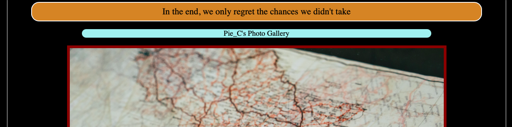
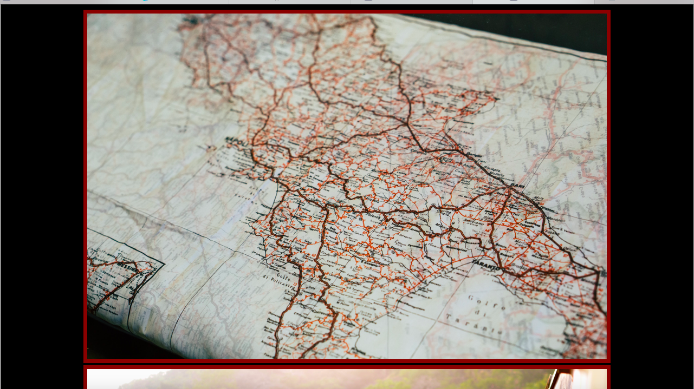

<h1>India Through Lens</h1>

Project Problem -> photography  
This is basic version of my travel blog which is based on HTML and CSS. 
Tech Stack -> HTML and CSS 

Project Description ->  I chose this problem cause of my personal interest in travelling  and photography. This project also has a lot of features that i can keep adding as i move ahead in my training . I tried adding as many as gimmicks i could and will keep working on it in future 

Here i have added  a navigation bar to directly take us to the images  
Added 2 buttons that link to instagram and youtube. 

I have also used CSS to give broders change fonts and have tried to make the site more impactful. 

This is where the Photo galary starts. 

